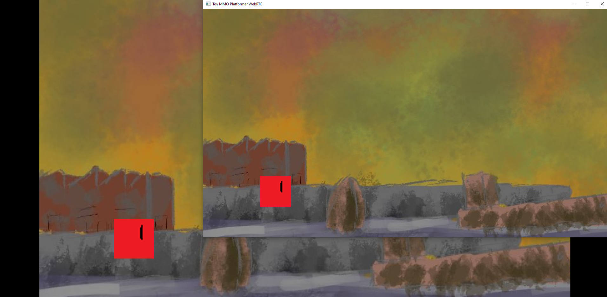

# Ebiten WebRTC Toy MMO

⚠️ *This is a piece of incomplete hobby work and not robust. Please read the "Why does this project exist?" section.*

## What is this project?

This is an authoritative server model demonstrating a very simple platformer game where players can move left, right and jump around. When running from the client from the browser, which in my testing, works fine on Chrome, Firefox and on Safari with my iPhone 6S.



**Controls:**

- Move Left = Left Arrow Key or Mouse/Touch Left Side of Screen
- Move Right = Right Arrow Key or Mouse/Touch Right Side of Screen
- Jump = Spacebar or Mouse/Touch Middle of Screen

## Why does this project exist?

This is a project that exists because I wanted practice applying concepts blogged about on [Gaffer On Games](https://gafferongames.com/), get better at networking code and leverage WebRTC to get UDP in the browser, as [UDP is recommended over TCP for real-time games](https://gafferongames.com/post/why_cant_i_send_udp_packets_from_a_browser/).

I consider myself to be game development hobbyist who isn't that experienced, so this project is likely to have code smells, mistakes or whatever else. However, I still thought it'd be valuable to put online, even in it's current incomplete state, because I've personally found that half-baked game developer examples get me closer to solving problems I wanted to solve, even if they lack correctness.

## Known problems and design choices

Here's a list of design choices made as well as known problems. There's more I'm probably not thinking of but hopefully they're somewhat commented in the code.

- We don't timeout the connection of the client reliably. It can hang trying to connect if UDP ports are blocked on either the server or client-side as it'll never end up opening a Data Channel.
- We don't support `ICERestart`, ie. if someones connection shifts from WiFi to 4G, the connection will probably be lost.
- We haven't thought about making the jitter buffer nice for getting client state from the server, so I'm not sure how smooth other players movement will be in poorer network conditions.
- The server doesn't reflect clients leaving on other clients.
- If the server is closed, the clients aren't notified or booted out.
- We chose to create packet data using Go structs and reflection instead of protobuf as protobuf comes with the overhead of requiring additional tools for code generation and adds a non-trivial amount of byte overhead. A [Gaffer On Games article](https://gafferongames.com/post/reading_and_writing_packets/) goes into detail on why hand-rolling packet types once you know your data is the better option. We didn't end up doing any sort of compression on packet data in this project.

## How to run locally and develop

The following commands need to be run from the root directory of the project.

### Server

```sh
go build -tags "server" -o server && ./server
```

We also have a headless server option which allows us to run on machines without graphic rendering capabilities.

```sh
go build -tags "server headless" -o server && ./server
```

### Client

#### Native

```sh
go build && ./toy-webrtc-mmo
```

#### Web

Start a web server that will serve the game client on http://localhost:8080/. This will rebuild the client everytime you refresh the page.

```sh
go build -o dev-server ./cmd/dev-server && ./dev-server
```

## How to deploy and server configuration

### Client

1.) Build WASM binary

```sh
GOOS=js GOARCH=wasm go build -o dist/main.wasm
```

2.) Zip up contents and put on a host somewhere. I put it on my Amazon EC2 instance and then served it with the "Asset Server" below.

### Server

This command builds a headless server which has two advantages:

- No overhead from rendering or draw calls
- Cross-compilation with environment variables just works

```
go build -tags "server headless" -o server
```

### Asset Server (optional)**

This is the server that serves the asset files for the web client:

- index.html
- main.wasm
- wasm_exec.js

1) Build asset-server from the "cmd/asset-server" folder

```
go build -o asset-server ./cmd/asset-server
```

2) Copy both "asset-server" and the "dist" folder to your server

3) Run the "asset-server" on your server. For me, my server was an Amazon EC2 instance.

```
./asset-server
```

### Server configuration

| Type | Port      | Description |
| -----------  | ----------- | ----------- |
| TCP | 50000   | Allow HTTP POST access to get WebRTC SDP / ConnectAuth        |
| TCP | 8080   | (Optional if you serve web files elsewhere) If using Asset Server, allow HTTP access for the web game client (serving assets, WASM file)        |
| UDP | 3478      | Allow STUN server       |
| UDP | 10000 - 11999   | UDP ports used by WebRTC DataChannels (We called `SetEphemeralUDPPortRange` in our code to make the UDP port range predictable / lockdownable)        |


## Credits

* [Pions WebRTC Authors and Contributors](https://github.com/pion/webrtc) for all their hard work on the Golang WebRTC libraries and allowing me to get this working in pure Go.
* [Glenn Fiedler](https://gafferongames.com/) for all their detailed blog posts on doing netcode, including *why you dont do* certain things.
* [Chen Tao](https://github.com/jagt) for their tool [clumsy](https://jagt.github.io/clumsy/), which has been invaluable for simulating and debugging weird network conditions on Windows.
